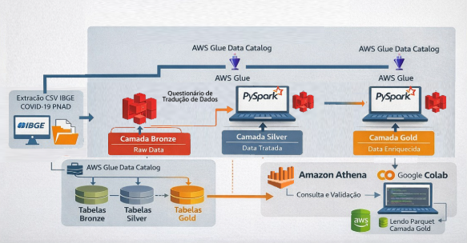

# 🏗️ Arquitetura do Projeto

Este projeto implementa um pipeline de dados end-to-end em ambiente cloud AWS para ingestão, transformação e análise dos dados da PNAD COVID-19.

## 📌 Visão Geral

O fluxo de dados segue uma arquitetura em camadas (raw → gold), utilizando serviços da AWS para garantir escalabilidade e organização dos dados.

## 🖼️ Diagrama da Arquitetura

## 🔄 Fluxo de Dados

1. **Fonte de Dados**
   - Dados da PNAD COVID-19 disponibilizados pelo IBGE em formato CSV
   - Selecionados meses de julho, agosto e setembro de 2020.
     
Fonte: https://www.ibge.gov.br/estatisticas/investigacoes-experimentais/estatisticas-experimentais/27946-divulgacao-semanal-pnadcovid1?t=downloads&utm_source=covid19&utm_medium=hotsite&utm_campaign=covid_19

2. **Ingestão (Raw Layer)**
   - Upload dos arquivos CSV para o Amazon S3
   - Armazenamento dos dados brutos sem transformação

3. **Processamento (ETL - via AWS Glue)**
   - Leitura dos dados da camada raw
   - Limpeza e padronização
   - Tratamento de valores ausentes
   - Aplicação de questionário de tradução dos dados

4. **Curadoria (Gold Layer)**
   - Escrita dos dados tratados no S3
   - Criação de features para análise (Índice de risco, Gravidade do caso, Internação, Score de isolamento, Presença de comorbidades, Perfil de risco comportamental, etc.)
   - Estruturação dos dados para consumo analítico

5. **Análise (EDA)**
   - Exploração dos dados com Python (Pandas / PySpark)
   - Geração de insights e visualizações

## 🧱 Arquitetura em Camadas

- **Raw**: Dados originais (imutáveis)
- **Silver**: Dados traduzidos com o questionário do IGBE, com tipos ajustados e tratamentos básicos
- **Gold**: Dados tratados, e prontos para análise incluindo features geradas

## ⚙️ Tecnologias Utilizadas

- AWS S3 (armazenamento)
- AWS Glue (ETL)
- AWS Glue Data Catalog
- AWS Amazon Athena
- PySpark
- Python (pandas)
- Jupyter / Google Colab
- Matplotlib
- Seaborn

## 🎯 Objetivos da Arquitetura

- Separação clara entre dados brutos e tratados
- Facilidade de manutenção e escalabilidade
- Reprodutibilidade do pipeline
- Suporte à análise exploratória e geração de insights
